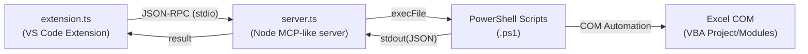

# 📤 EXCEL VBA module Sync - VSCode ⇄ Excel


## 概要（Japanese）

**EXCEL VBA module Sync** は、開いているExcel の VBA モジュールを VSCode 上で編集するための拡張機能です。  
VBA モジュールのVSCodeへのエクスポート、VSCodeで編集した内容のVBAへのインポートが行えます。
Winsdows10/11＋Excel＋VSCode環境のみです。

- ✅ Excelから `.bas` / `.cls` / `.frm` 内のコードをエクスポート（保存）
- ✅ VSCode 上で編集
- ✅ 編集したモジュールを Excel にインポート（反映）
- ✅ インポートはモジュール差し替えにて行います
- ✅ エクスポートしたモジュールファイルはgitで管理しやすいようにUTF-8の文字コードで出力されます。
- ✅ Excel マクロ実行（モジュール＋プロシージャ、または完全修飾名で実行可能）
- ✅ VBA コード検索（開いている全ブック・全モジュールを対象に、正規表現やフィルタ指定で検索可能）

### 🔧 主な機能

| 機能                           | 説明                                      |
|--------------------------------|-------------------------------------------|
| Export All Modulus From VBA    | Excel から全モジュールを抽出・保存します。|
| Import Module To VBA           | VSCode 上で編集したコードを Excel に反映（単独モジュール/ファイル） |
| Set Export Folder              | ダイアログ選択可能                        |
| コマンドパレット／ボタン対応      | GUI 操作または `Ctrl+Shift+P` から実行可  |
| List &Run Macro                | 	指定マクロを実行                              |
| Search VBA Code	             |全ブック・モジュール対象にコード検索（正規表現対応） |
---

## Overview (English)

**EXCEL VBA module Sync** is a VSCode extension for editing opened Excel VBA modules.  
You can export VBA modules to VS Code and import the content edited in VS Code back into VBA.
Works in a Windows 10/11 + Excel + VS Code environment only.

- ✅ Export inner code of  `.bas` / `.cls` / `.frm` from Excel
- ✅ Edit VBA modules in VSCode
- ✅ Import modules back into Excel
- ✅ Import is performed by replacing the module.
- ✅ Exported module files are saved in UTF-8 encoding, making them easier to manage with Git.
- ✅ Execute Excel macros (by module/procedure or fully qualified name)
- ✅ Search VBA code (across all open workbooks/modules, with regex and filters supported)

### 🔧 Features

| Feature                        | Description                                      |
|--------------------------------|------------------------------------------------------------------|
| Export All Modules From VBA    | Extract and save all VBA modules from Excel                      |
| Import Module To VBA           | Reflect modified code back to Excel(Module-based/File-based)     |
| Set Export Folder              | Change export folder via Dialog                                  |
| Command Palette / GUI support  | Use commands or side panel buttons                               |
| List &Run Macro	             | Execute macros by name or fully qualified path                   | 
| Search VBA Code	             | Search VBA code (regex supported)                                | 
---
## 🧩 インストール（VSIX） / Install from VSIX

### From Marketplace
1. [Visual Studio Marketplace - excel-vba-sync](https://marketplace.visualstudio.com/items?itemName=9kv8xiyi.excel-vba-sync)  
2. Visual Studio Code を開き、拡張機能ビューからインストール  

## 拡張機能ビューからできない場合は、以下をお試しください。

### From Marketplace(Powershell)
以下コマンドを実行
```powershell
code --install-extension 9kv8xiyi.excel-vba-sync
```

### From Github(VSCode)
1. https://github.com/EitaroSeta/excel-vba-sync/releases/download/latest/extension.vsix より`extension.vsix`をダウンロード
2. VS Code を開く
3. 拡張機能ビュー（Ctrl+Shift+X / Cmd+Shift+X）を開く
4. 右上の「…」メニュー → **VSIXからのインストール...** を選択
5. ダウンロードした`extension.vsix` ファイルを選択
6. Reloadを実行

### From Github(Powershell)
以下コマンドを実行
```powershell
$URL = "https://github.com/EitaroSeta/excel-vba-sync/releases/download/latest/extension.vsix"
$OUT = "$env:TEMP\extension.vsix"
curl.exe -sS -L -f --retry 3 --retry-delay 2 "$URL" -o "$OUT"
code --install-extension "$OUT"
```

## ⚠重要 / Important ##

**●エクスポートしたファイルの属性は編集しないでください**
> エクスポートした **`.frm/.cls/.bas`** の **属性行は編集しないでください**。`VERSION`、`Begin … End`、`Object = …`、および `Attribute VB_*`（例：`VB_Name` / `VB_PredeclaredId` / `VB_Exposed` / `VB_Creatable` など）を変更すると、**インポート失敗**や**既存フォームとの紐付け崩れ**が発生します。  

**●モジュールの新規追加はできません**
>既存のモジュール/クラス/フォームを入替えを行う仕組みの為、新規の追加はできません。 VBA上で新規モジュールを追加し、エクスポートしてください。

**●EXCELファイルは必ずバックアップしてください**
>この拡張機能はEXCELファイルを外部から操作する仕組みなので、条件によりEXCELファイルを破損させる恐れがあります。EXCELファイルのバックアップを必ず取ってから連携させて下さい。

**●COMエラーについて**
>Excel に長時間触れずに放置した後や、画面ロック復帰直後などにインポート／エクスポートを実行すると、
次のようなエラーが発生する場合があります。  

`STDERR: Call was rejected by callee. (HRESULT からの例外:0x80010001 (RPC_E_CALL_REJECTED))`  

>これは Excel 側が一時的に応答できない状態にあるため、COM 呼び出しが失敗して発生するエラーです。  
この場合は **Excelを再起動**すると解消されます。

**●Do **not** edit attributes of exported files**
> Do **not edit the attribute lines** in exported **`.frm/.cls/.bas`** files. Changing `VERSION`, `Begin … End`, `Object = …`, or any `Attribute VB_*` (e.g., `VB_Name`, `VB_PredeclaredId`, `VB_Exposed`, `VB_Creatable`) can cause **import failures**,  and **loss of linkage** to the original form.  

**●New modules, classes, or forms cannot be added;**
>New modules, classes, or forms cannot be added; this tool only replaces existing ones.If you need to create a new item, first add a blank module/class/form in the VBE, then export it.

**●Please back up your EXCEL files**
>This extension operates externally on EXCEL files, so depending on the conditions, there is a risk of corrupting the file. Please make sure to always back up your EXCEL files before linking them with this extension.

**●About COM Error**
>When running import/export operations after leaving Excel idle for a long time or resuming from a screen lock,
you may encounter the following error:  

`STDERR: Call was rejected by callee. (HRESULT 0x80010001)`  

>This occurs because Excel is temporarily unable to respond, causing the COM call to fail.  
**Restarting Excel** will resolve the issue.

---

## 🛠 開発者向け情報 / Development (for GitHub users)
このセクションは拡張機能の利用者には不要です。拡張の開発や修正向けの作者の備忘です。  
https://github.com/EitaroSeta/excel-vba-sync  

### 前提 / Requirements
- Windows10/11 + Microsoft Excel（VBA を実行するため）
- Windows PowerShell 5.1/v2025.2.0（PowerShell 7 は未検証）
- Node.js LTS（18 以上推奨）と npm  
- Visual Studio Code（拡張の起動・デバッグに使用）  

### セットアップ / Setup
```powershell
npm install
```

### ビルド & 実行 / Build & Run
```powershell
npm run compile
```
- VS Code で `F5` を押して **Extension Development Host** を起動

### 主要コマンド / Key Commands
- **Export All Modules From VBA** — Excel から VBA モジュールを一括エクスポート
- **Import Module To VBA** — 編集したモジュールを Excel に取り込み
- **Set Export Folder** — エクスポート先フォルダの指定  

### パッケージ化 / Package
`vsce` で配布用 `.vsix` を作成できます（CLI）。  
```powershell
npm i -g @vscode/vsce  
vsce package
```
`.vscodeignore` により TypeScript やテスト等はパッケージから除外されます。

### リポジトリ構成（抜粋） / Repo Layout
- `src/` — 拡張のソースコード（TypeScript）
- `scripts/` — Excel 連携用 PowerShell Script
- `locales/` — 多言語リソース（`ja.json`, `en.json`）  

### アーキテクチャ変更概要
v.0.0.27の機能追加にて、VS Code (`extension.ts`) から Node.js サーバ (`server.ts`) を子プロセスとして起動し、さらに PowerShell スクリプト経由で Excel COM API を操作する流れが追加されました。


## ⚙️ ローカライズ設定例 / Localization Example

拡張機能の表示テキストは locales フォルダの言語別 JSON ファイルで管理しています。  
現在は以下の2言語に対応していますので、*.jsonを使用したい言語に合わせて作ってください。

The extension’s display text is managed in language-specific JSON files located in the locales folder.  
Currently, the following two languages are supported, so please create a *.json file for the language you want to use.

 locales/  
  ├─ ja.json  
  └─ en.json


